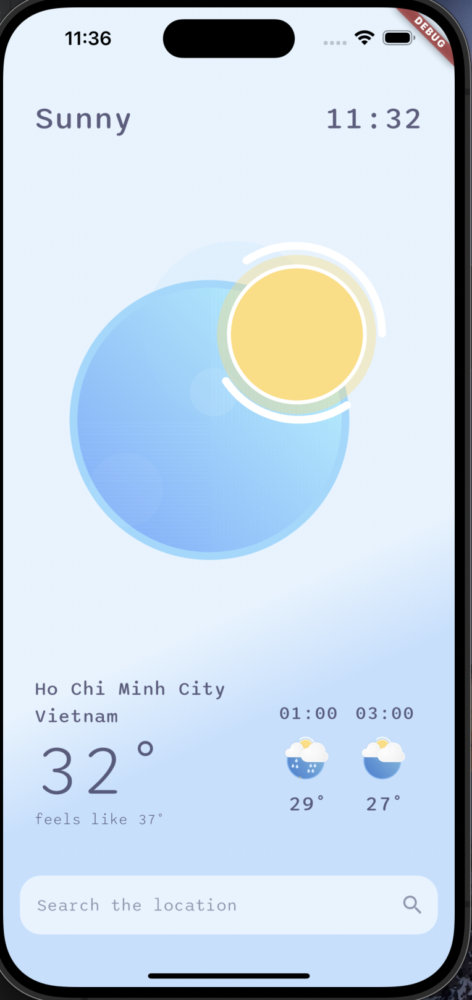

# Flutter Weather App

<p float="left">
  
   
  
</p>
<p float="left">
   
  
</p>

## Overview

Flutter weather including features: search location, get weather of location, lottie animation for
weather icon, using flutter version 3.16

## Getting Started

### Setup

To set up the project, follow these steps:

1. Clone the repository to your local machine:

    ```bash
    git clone https://github.com/your-username/flutter-weather-app.git
    ```

2. Navigate to the project directory:

    ```bash
    cd flutter-weather-app
    ```

3. Run the setup command:

    ```bash
    make setup
    ```

   This command installs the necessary dependencies for the project.

### Running the App

Once the setup is complete, you can run the project using the following command:

```bash
make run
```

### This using api from http://weatherapi.com

please get your own api key and replace WEATHER_API_KEY in env/.env